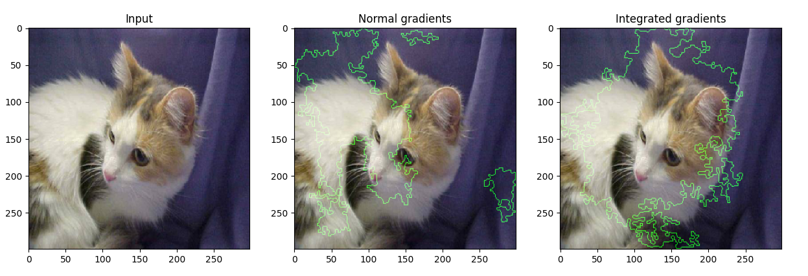
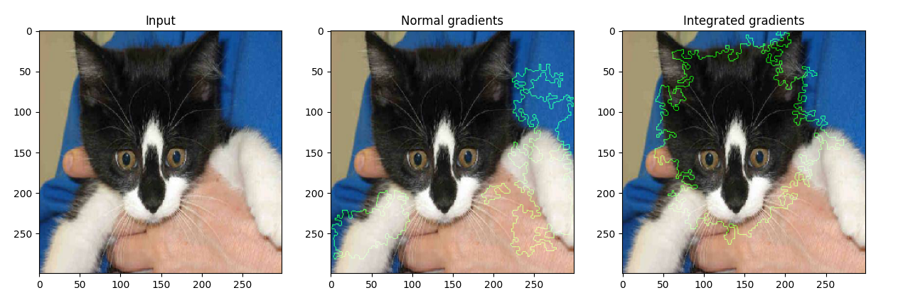

# image-integrated-gradients

先前在[text-integrated-gradients](https://github.com/allenwind/text-integrated-gradients)中尝试过使用integrated gradients进行NLU可视化，这里提供integrated gradients在图像上的可视化。


首先训练一个模型，这里使用xception进行fine-tune，

```bash
$ python3 model_pretrain.py
```

获得权重后，运行

```bash
$ python3 visualize.py
```

可以获得梯度与积分梯度的可视化对比。


可视化示例一：



可视化示例二：




## 参考

[1] https://www.floydhub.com/fastai/datasets/cats-vs-dogs
[2] https://github.com/allenwind/tensorflow-in-large-dataset
[3] https://github.com/allenwind/text-integrated-gradients
[4] https://keras.io/examples/vision/integrated_gradients/
